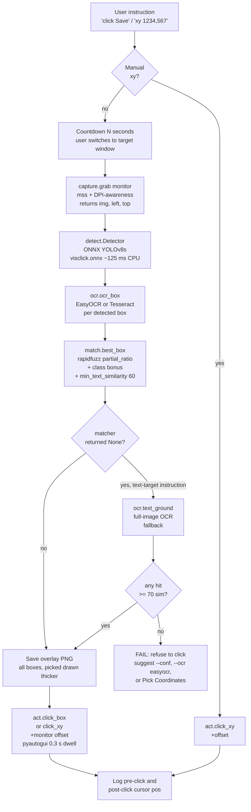

# VisClick — Project Report **Data** Form (v2 — measurements only)

**Why this form exists.** Once you hand this back, I will write the full ~120-page MSc project report. You do **not** need to write any prose. The form only asks for things I cannot fabricate: numbers from your real experiments, file paths to your real screenshots/charts, your real PC specs, your real library versions.

Anything else (literature review prose, requirements wording, requirements priorities, LEPSI text, RQ achievement paragraphs, conclusion reflections, interview-style qualitative paragraphs, control-study prose) — **I write that** and you only review/edit my draft.

**Where each field comes from.** The detailed plan (`VisClick_Detailed_Plan.md`) is now stamped with `→ RECORD` callouts at every step that produces a number or file. The callout names the section of *this* form. Just drop the value into the matching section.

**Conventions:**

- `[FILL]` → write a value or file path.
- Tables — fill cells. Empty cell = `N/A`.
- File paths are relative to `gui_temp/`. Easiest workflow: drop everything into `gui_temp/figures/`, `gui_temp/tables/`, `gui_temp/videos/` and just give me the file name.
- Skipped experiment? write `SKIPPED`. I will explain it in the report and in the limitations.
- Number not in yet? write `PENDING`. We will fill it later.
- Anything you do not understand? write `???` next to it; I will rewrite the question.

**Minimum viable hand-back.** If you only have time for the bare minimum, I can still write a defensible report with:
- §1 (your hardware + libraries)
- §2 (final dataset counts)
- §4 (one row, your headline model — at minimum mAP@.5, P, R, F1, latency, training time)
- §5 (which row is the headline)
- §8 (six prototype screenshots)
- §9 (≥10 functional task results)
- §10 (latency over 20 runs + peak memory)
- §12 (repo URL + weights paths + demo video path)

Everything else strengthens the report; nothing else blocks it.

---

## §0 — Dataset acquisition log (raw Colab downloads)

**What to paste here:** every line from a notebook that starts with `REPORT ` (from `01_pull_and_data.ipynb` and `02_rico_zenodo_vins.ipynb`, plus later notebooks as we add them). I will copy those values into the tables below so you do not have to reformat them by hand.

**When:** after each acquisition notebook run (you can also paste the full cell output in chat and I will transfer it here).

*Last refresh: **`07` ONNX export scaffolded + Windows prototype scripts in `scripts/test_*.py`**. To produce numbers for §4.1 (Win-CPU ONNX latency) and §10.1, run `notebooks/07_export_onnx.ipynb` in Colab, then `python scripts/test_detector.py screenshots/test_screen.png --bench 50` on the Windows machine.*

### §0.1 — Per-dataset / artifact (from `REPORT dataset = ...` lines)

| Key | Path on Drive | Files (latest reading) | Size (GB) | Status (OK / EMPTY / FUSE-UNRELIABLE / MANUAL_PENDING) | Notebook / note |
|-----|---------------|----------------------|-----------|----------------------------------------|-----------------|
| CLAY | `My Drive/visclick/data/clay` | 32 | 0.034 | OK | `03` inventory — labels CSVs only; images come from RICO |
| UI-Vision | `My Drive/visclick/data/ui_vision` | 2,942 | 0.784 | OK | `03` inventory — matches plan §C.2.5 (~781 MB) |
| RICO (extracted) | `My Drive/visclick/data/rico` (**`combined/`** for UI files) | visible in Drive web; **Colab FUSE returns 0 intermittently** | ~8 (from `02` extract) | FUSE-UNRELIABLE | see §0.3 — Drive FUSE can't list the 66k-file `combined/` reliably |
| RICO TAR (raw) | `My Drive/visclick/data/raw/unique_uis.tar.gz` | 0 B | — | MISSING (removed after extract) | — |
| RICO ZIP (legacy) | `My Drive/visclick/data/raw/rico_unique_uis.zip` | 0 B | — | MISSING (unused) | — |
| Zenodo `train.zip` | `My Drive/visclick/data/raw/train.zip` | 0 B | — | **MISSING** — *deleted after extract to save space* | `02` |
| Zenodo `val.zip` | `My Drive/visclick/data/raw/val.zip` | 0 B | — | **MISSING** — *deleted after extract* | `02` |
| Zenodo `test.zip` | `My Drive/visclick/data/raw/test.zip` | 0 B | — | **MISSING** — *deleted after extract* | `02` |
| Zenodo unified — root (walk is truncated by FUSE) | `My Drive/visclick/data/unified` | 52,569 (partial) | 64.928 (aggregate) | OK but walk partial — see §0.3 | `03` inventory |
| Zenodo unified — `train/images` | `My Drive/visclick/data/unified/train/images` | 84,104 | 7.317 | OK | `03` inventory (stable via shell `find`) |
| Zenodo unified — `val/images` | `My Drive/visclick/data/unified/val/images` | 21,026 | 63.140 | OK (full-res PNGs; heavy) | `03` inventory — `04` filters with `MAX_IMG_BYTES=6MB` |
| Zenodo unified — `test/images` | `My Drive/visclick/data/unified/test/images` | 10,513 | 0.918 | OK | `03` inventory |
| VINS repo | `My Drive/visclick/data/raw/vins_repo` | 28 | ~0.000 | OK | `02` REPORT |
| VINS images | `My Drive/visclick/data/vins` | 0 | 0.000 | EMPTY (optional) | plan §C.2.4 marks VINS images as an external archive |
| WebUI raw (optional) | — | — | — | SKIPPED (Zenodo unified used) | — |
| **Local** `source_train` (built by `04`) | `/content/source_train` (ephemeral; rebuilt each session) | 10,000 (8000 train + 1000 val + 1000 test) | ~0 on Drive (symlinks) | OK | `04` REPORT — **no Drive duplication**: images are symlinks into `unified/<split>/images/` |
| `source_train` bundles (Drive persistence) | `My Drive/visclick/data/source_train_bundles/` — `train.tar.gz` (1.42 MB), `val.tar.gz` (0.19 MB), `test.tar.gz` (0.18 MB) | 3 tarballs | **0.0018** | OK | `04` REPORT PERSIST — labels + image-filename manifests so `05`+ can fast-restore in ~20 s. **Total Drive footprint: 1.8 MB.** |
| Desktop seed screenshots (versioned in repo) | `samples/desktop_seed/` (in git) → auto-copied to `My Drive/visclick/data/desktop/raw/` on first run of `06` | 50 (48 PNG + 2 JPG) | 0.016 | OK | 50 personal screenshots of VS Code (light/dark) + Excel ribbon + Chrome. Tracked in git so the desktop fine-tune is reproducible from a fresh clone. `06` cell 6.1 auto-seeds Drive from the cloned repo if `data/desktop/raw/` is empty. |
| Desktop pseudo-labels (from `06` cell 6.1) | `My Drive/visclick/data/desktop/labels/` | 50 `.txt` (one per image) | ~0.0001 | OK | Auto-generated by `best_source_v8s.pt` at `conf=0.20`. **346 total detections, 48/50 imgs ≥ 1 detection.** Class mix: text 244, icon 90, button 8, text_input 4, **menu 0, checkbox 0** — 4 of 6 classes have signal; 2 are zero (teacher does not fire on desktop menubars/ribbons or checkboxes). See §4.6 + §13 O11. |
| **Local** `desktop_finetune` (built by `06`) | `/content/desktop_finetune/{images,labels}/{train,val,test}/` (ephemeral) | 50 imgs (34 / 8 / 8) | ~0.016 local | OK | Deterministic 70/15/15 split, `random.seed(42)`. **Note:** unlike `source_train`, images are **copied** (not symlinked) because the dataset is tiny; the bundle therefore includes images themselves. |
| `desktop_finetune` bundles (Drive persistence) | `My Drive/visclick/data/desktop_finetune_bundles/` — `train.tar.gz` / `val.tar.gz` / `test.tar.gz` | 3 tarballs | ~0.014 (images + labels) | OK | `06` cell 6.3 PERSIST — full split (images + labels) so any new Colab tab restores `/content/desktop_finetune/` in ~5 s. |

### §0.2 — Colab / environment (from `REPORT §1.2` / `REPORT §1.3` / `colab_python`)

| Field | Value |
|-------|-------|
| `colab_python` | 3.12.13 |
| `nvidia_smi` (GPU name) | Tesla T4, 15360 MiB |
| `torch` (Colab) | 2.10.0+cu128 |
| `numpy` (Colab) | 2.0.2 |
| `git_head` (notebook 02) | `PENDING` — add from `git -C /content/visclick rev-parse --short HEAD` if needed |

### §0.3 — Known data-pipeline issues & workarounds (findings from `01`–`04`)

These are **real issues we hit during acquisition / assembly** and the concrete workarounds that are now baked into the notebooks. Cite these in Chapter 6 (Implementation) and Chapter 9 (Challenges / Learning outcomes).

| # | Issue | Symptom | Workaround now in the repo |
|---|-------|---------|----------------------------|
| F1 | Drive FUSE timeouts on large directories | Colab pop-up *"A Google Drive timeout has occurred"*; `os.listdir` raises `OSError: [Errno 5] Input/output error` on `unified/train/labels/` (84k files) and on `rico/combined/` (~66k files) | `04_assemble_source.ipynb` helper `_list_labels_robust()` — retries `os.listdir` 4× with 5 s back-off, then falls back to shell `find … -maxdepth 1 -type f -printf '%f\n'` with a 240 s timeout, and **caches the listing** to `/content/_unified_<split>_labels.list` so the rest of the session (and session re-runs) skip the slow read. |
| F2 | RICO `combined/` invisible in Colab despite being on Drive | `os.walk` and even `find` report 0 files for `data/rico/combined/`; the same folder shows data in `drive.google.com` | Treated as non-blocking. Plan §C.5 uses the **unified Zenodo bundle** as the main training source, so RICO images are not required. Re-extracting from `01_pull_and_data.ipynb` tar (after `force_remount=True`) is a fallback. |
| F3 | Zenodo `val` split unexpectedly heavy (~63 GB for 21 k images) | avg 3 MB/image because val contains full-resolution PNGs while train is JPG | `04` skips images > `MAX_IMG_BYTES` (default 6 MB). Logs `skipped_big` in REPORT. |
| F4 | Drive-to-Drive image copies are slow and duplicate data | initial `04` design copied ~10k images from `unified/` to `source_train/` → wasted ~5 GB of Drive and multi-hour Drive-FUSE copy | `04` now uses `USE_SYMLINKS=True` and writes `source_train` to **local `/content/source_train/`**. Only tiny remapped `.txt` labels are materialised. 0 bytes added on Drive. |
| F5 | GitHub push auth from remote/EDA host | `git push` over HTTPS failed with *no askpass* and ssh key `id_rsa` rejected (not registered on the account) | Used a GitHub **Personal Access Token** read from a `.gitignore`d `token` file at the repo root; token kept off Drive and off GitHub. |
| F6 | Drive listing is sometimes partial even when `find` succeeds | `03` inventory: `unified` root walk reported 52,569 files while the three per-split walks summed to 115,643 | Trust the per-split numbers; the root-level count is a Drive-FUSE truncation artifact. Sub-walks with fewer entries are reliable. |
| F7 | Assembly throughput on Drive is ~1 image/sec | 8000 images took ~39–56 min across two runs; val 1000 ~6 min; test 1000 ~5 min | One-time cost. Future sessions restore in ~20 s via the bundle (F8). |
| F8 | Session-persistence without Drive duplication | Drive is tiny (~7 MB total); copying 10k images to persist across Colab sessions would waste GB | `04` tars just **labels + a manifest of image filenames** to `<DRIVE>/data/source_train_bundles/{train,val,test}.tar.gz` — **3 files, ~1.8 MB total** (1.42 / 0.19 / 0.18 MB). `05`'s first cell auto-bootstraps: extract labels + recreate symlinks into `unified/<split>/images/`. Any future notebook opens directly from GitHub; no need to re-run `04`. |
| F9 | Colab Free idle / session disconnect mid-training | training stopped mid-epoch 11 of 30; Ultralytics had logged epoch 10 val (`mAP50 = 0.493`) before the disconnect; GPU was at 6.98 G / 14.9 G — not OOM, just Colab Free's idle/session timeout | `05` writes `last.pt` to Drive after every epoch (`project=<DRIVE>/weights/baseline_source/run1/`). On a new Colab runtime the train cell detects `last.pt`, calls `model.train(..., resume=True)` and continues from the next epoch. **Zero training progress lost on disconnect.** Combined with `5.1` bootstrap (F8), the full session is recoverable in ~30 s + remaining epochs. |
| F10 | Ultralytics `stream=True` rewrites `Result.path` | with `model.predict(source=list_of_paths, stream=True)` on Ultralytics 8.4.46, every yielded `Result.path` is a stream-index name (`image0.jpg`, `image1.jpg`, ...) instead of the source path passed in. `06` cell 6.1's first version derived label filenames from `r.path`, so all 50 labels were written as `image0.txt..image49.txt` and cell 6.3 found `n_with_labels = 0/50` because basenames did not match the images (`1.png..50.jpg`). | `06` cell 6.1 now zips `to_run` with the predict iterator and uses the **input** path's basename: `for src_path, r in zip(to_run, model.predict(...stream=True)): stem = os.path.splitext(os.path.basename(src_path))[0]`. Order is preserved by Ultralytics. A one-shot rename helper is documented in chat history for any pre-fix run. |
| F11 | Drive FUSE caches `readdir` and `stat` separately | immediately after `06` cell 6.1 wrote 50 `.txt` files, `glob.glob(LABELS + "/*.txt")` saw all 50 (used at end of 6.1 to count classes — ✅), but per-file `os.path.isfile()` returned `False` for every one (cell 6.3's `pairs` was 0/50). The `stat` cache lags the `readdir` cache by several seconds on Drive FUSE. | `06` cell 6.3 now uses `_list_label_stems()` — a directory-listing helper that **never calls `os.path.isfile()`** for discovery. Tries `glob.glob`, then `os.listdir`, then shell `find -maxdepth 1 -type f`, with 4 retries and 3 s sleeps. Builds a `set()` of stems and pairs by string membership. Same pattern proven on the unified labels in `04` (F1). |

> **Rule we adopted after F1–F4:** every notebook step that could download or copy **first checks whether the data is already where it belongs, and only runs the slow operation when something is missing.** This makes the notebooks safe to re-run after a Colab disconnect.

---

## §1 — Computing environment

### §1.1 — Windows machine you used to run the prototype

| Field | Value |
|-------|-------|
| Device name | `[FILL]` |
| Processor (full string) | `[FILL]` |
| Cores / threads | `[FILL]` |
| Installed RAM (GB) | `[FILL]` |
| Storage type + size | `[FILL]` |
| Graphics card (if any) | `[FILL]` |
| OS version | `[FILL]` (e.g. Windows 11 Pro 23H2) |
| Display resolution | `[FILL]` (e.g. 1920×1080) |
| Display scaling | `[FILL]` (e.g. 100% / 125% / 150%) |

### §1.2 — Google Colab observations

| Field | Value |
|-------|-------|
| Tier (Free / Pro / Pro+) | `[FILL]` |
| GPU you most often got | Tesla T4 15 GB (15360 MiB) — from `01` REPORT §1.2 (latest) |
| Approx total GPU-hours used | `[FILL]` |

### §1.3 — Library versions actually installed (paste from `pip freeze`)

| Library | Version |
|---------|---------|
| Python | 3.12.13 (Colab; from `01`/`02` REPORT) — update if local venv differs |
| ultralytics | 8.4.45 (Colab `05` REPORT — Apr 30, 2026 run) |
| torch | 2.10.0+cu128 (Colab `02` REPORT) — also record training venv when you train |
| opencv-python | `[FILL]` |
| numpy | 2.0.2 (Colab `02` REPORT) |
| pyautogui | `[FILL]` |
| mss | `[FILL]` |
| pytesseract | `[FILL]` |
| easyocr | `[FILL]` |
| onnxruntime | `[FILL]` |
| rapidfuzz | `[FILL]` |
| psutil | `[FILL]` |

### §1.4 — Tooling

| Tool | Value |
|------|-------|
| Tesseract install path | `[FILL]` (default `C:\Program Files\Tesseract-OCR\tesseract.exe`) |
| Demo recording tool | `[FILL]` (OBS / ShareX / other) |
| Annotation tool | `[FILL]` (CVAT cloud / CVAT self-hosted) |
| Approx total annotation hours | `[FILL]` |

---

## §2 — Final dataset counts (after preprocessing & class-mapping)

### §2.1 — Source-domain assembled training set (from §C.5 of the plan)

Per-class instance counts after the assembly script runs. Numbers below are from the **latest `04_assemble_source.ipynb` run (the one that also wrote the Drive bundles — `REPORT step = PERSIST | status = DONE`)**, totalled across train + val + test (8000 / 1000 / 1000 images respectively). Numbers vary by ±0.1% between runs because Drive FUSE's `isfile()` occasionally mis-reports an image as missing (`skipped_noimg` column in `04` REPORT); this is a listing artefact, not actual data corruption.

| Class | Instances (train + val + test) |
|-------|-------------------------------:|
| button | 22,423 |
| text | 70,912 |
| text_input | 3,848 |
| icon | 62,471 |
| menu | 7,433 |
| checkbox | 1,562 |
| **Total images in source set** | **10,000** (8000 / 1000 / 1000) |

> **Class imbalance note (for §6 Implementation / §9 Challenges):** `text` and `icon` dominate because the unified 12-class taxonomy's `Text`+`Link` both map to `text` and `Image`+`Icon` both map to `icon`. `checkbox` is the minority (~1.5k). If the headline model underperforms on `text_input` / `checkbox`, top-up from CLAY-mapped / VINS images (once available) or class-weighted loss is the planned mitigation. See §E.3 / §D.4 of the detailed plan.

**Per-split breakdown** (from `REPORT step = ASSEMBLE` lines in `04`):

| Class | train (8000 imgs) | val (1000 imgs) | test (1000 imgs) |
|-------|-----------------:|----------------:|-----------------:|
| button | 18,049 | 2,251 | 2,123 |
| text | 56,416 | 7,550 | 6,946 |
| text_input | 3,027 | 439 | 382 |
| icon | 50,082 | 6,298 | 6,091 |
| menu | 5,986 | 737 | 710 |
| checkbox | 1,262 | 159 | 141 |

**Assembly wall-clock** (bundle-building run):

| Split | Elapsed | Kept | `skipped_noimg` | `skipped_big` | `skipped_err` |
|-------|--------:|-----:|----------------:|--------------:|--------------:|
| train | 3 384 s (~56 min) | 8 000 | 735 | 0 | 0 |
| val   |   390 s (~6.5 min) | 1 000 | 633 | 0 | 0 |
| test  |   375 s (~6.3 min) | 1 000 | 688 | 0 | 0 |

After this run the bundles (labels + manifest) are on Drive (~1.8 MB total); every future Colab session restores `/content/source_train/` in seconds via `05`'s bootstrap cell.

### §2.2 — Target desktop set (from §E.1 / §F.4 of the plan), screenshots per app

50 personal screenshots (48 PNG + 2 JPG, ~16 MB) tracked in the repo at `samples/desktop_seed/`. Three apps actually appear; the form's original Notepad / File Explorer rows are not in this corpus. Splits are produced by `06` cell 6.3 with `random.seed(42)`; the random shuffle does **not** preserve per-app distribution.

| App | Train | Val | Test | Notes |
|-----|-------|-----|------|-------|
| VS Code (light + dark, Explorer / Extensions / Problems pane) | from random split | from random split | from random split | bulk of the 50 |
| Excel (full ribbon — Formulas / Insert / Home tabs) | from random split | from random split | from random split | dense small icons |
| Chrome (browser windows, address bar) | from random split | from random split | from random split | minority |
| File Explorer / Notepad | 0 | 0 | 0 | not collected for v1 — covered by UI-Vision generalisation in §7 if required |
| **Totals** | **34** | **8** | **8** | from `06` REPORT final |

### §2.3 — Target desktop set, instances per class per split

From `06` cell 6.3 `REPORT final` lines (May 4, 2026). 50 images, 346 total pseudo-label instances split deterministically (`random.seed(42)`).

| Class | Train (34 imgs) | Val (8 imgs) | Test (8 imgs) |
|-------|-----------------:|--------------:|---------------:|
| button | 7 | 1 | 0 |
| text | 178 | 50 | 16 |
| text_input | 3 | 1 | 0 |
| icon | 74 | 8 | 8 |
| menu | 0 | 0 | 0 |
| checkbox | 0 | 0 | 0 |
| **Total** | **262** | **60** | **24** |

> **Critical caveat — pseudo-label class collapse + small-test-set artefact.** `menu` and `checkbox` have **zero** instances anywhere because the source-domain teacher (mAP@.5 = 0.45 on its own GT) does not fire on Windows menubars / Excel ribbons / dialog tickboxes. `button` and `text_input` together total only 12 instances across all 50 images and the random shuffle sent every one of them into train+val — none into test. Head-only fine-tuning cannot learn what it never sees in train, and `model.val(split="test")` cannot score classes that have no test instances. This is the dominant reason the §4.6 desktop per-class breakdown shows `NaN` for 4 of 6 classes and is the most important honest limitation of the §4.1 *Desktop FT* row. The fix for a dissertation-grade headline number is hand-correcting the 8 test images in Roboflow (~30 min) so menus and checkboxes are explicitly marked + every test image has at least one box per applicable class, then re-running `06` from cell 6.3. See §13 O11.

> **Critical caveat — pseudo-label class collapse.** `menu` and `checkbox` have **zero** instances anywhere because the source-domain teacher (mAP@.5 = 0.45 on its own GT) does not fire on Windows menubars / Excel ribbons / dialog tickboxes. Head-only fine-tuning cannot learn what it never sees. This is the dominant reason the §4.6 desktop per-class breakdown shows `NaN` for those two classes and is the most important honest limitation of the §4.1 *Desktop FT* row. The recommended fix for a dissertation-grade headline number is hand-correcting the 8 test images in Roboflow (~30 min) so menus and checkboxes are explicitly marked, then re-running `06` from cell 6.3. See §13 O11.

---

## §3 — Preprocessing artifacts

### §3.1 — Three before/after pairs (one per app theme/scenario)

Drop the PNGs into `gui_temp/figures/` and paste the file names below.

| Pair | Before | After |
|------|--------|-------|
| 1 (e.g. VS Code dark) | `figures/[FILL]` | `figures/[FILL]` |
| 2 (e.g. File Explorer light) | `figures/[FILL]` | `figures/[FILL]` |
| 3 (e.g. Notepad small text) | `figures/[FILL]` | `figures/[FILL]` |

### §3.2 — EDA figure paths

Produced by `03_eda.ipynb` under `<DRIVE>/reports/figures/eda/` (drop the PNGs into `gui_temp/figures/` with these same names when collecting the report).

| Figure | Path | Status |
|--------|------|--------|
| Source (unified) class distribution — train | `figures/eda_unified_train_classes.png` | PENDING (`03` partial) |
| Source (unified) class distribution — val | `figures/eda_unified_val_classes.png` | PENDING |
| Source (unified) class distribution — test | `figures/eda_unified_test_classes.png` | PENDING |
| Source (unified) resolution histogram — train | `figures/eda_unified_train_resolutions.png` | PENDING |
| Source (unified) 9-sample grid with boxes — train | `figures/eda_unified_train_samples.png` | PENDING |
| CLAY class distribution (mapped) | `figures/eda_clay_classes.png` | PENDING |
| RICO resolution histogram | `figures/eda_rico_resolutions.png` | BLOCKED — Drive FUSE can't list `rico/combined/` (see §0.3 F2) |
| RICO 9-sample grid | `figures/eda_rico_samples.png` | BLOCKED — same as above |
| UI-Vision resolution histogram | `figures/eda_uivision_resolutions.png` | PENDING |
| UI-Vision 9-sample grid | `figures/eda_uivision_samples.png` | PENDING |
| Desktop class distribution bar chart | `figures/[FILL]` | autolabel counts available (text 244, icon 90, button 8, text_input 4, menu 0, checkbox 0) — bar chart not yet plotted; can be drawn from `tables/desktop_finetune_per_class.csv` + the autolabel REPORT lines in chat |
| Desktop autolabel preview (9-sample grid with boxes) | `figures/desktop_autolabel_preview.png` | DONE — saved by `06` cell 6.2 (Ultralytics' renderer; thick color-coded boxes) |
| Desktop autolabel preview — full resolution | `<DRIVE>/weights/desktop_finetune/autolabel_preview_full/*.png` (5 imgs) | DONE — saved by `06` cell 6.2 with `save=True`; one annotated PNG per source so labels can be eyeballed at native res |
| Desktop fine-tune training curves | `figures/desktop_finetune_curves.png` | DONE — copied by `06` cell 6.6 from `<DRIVE>/weights/desktop_finetune/run1/results.png` |
| Desktop fine-tune sanity predictions on test split | `<DRIVE>/weights/desktop_finetune/predict_test/*.png` (8 imgs) | DONE — saved by `06` cell 6.6 |

---

## §4 — Per-model experimental results (one row per model you actually trained)

For every model M0..M8 you actually trained, fill ONE row with **hyperparameters + results**. If you skipped a model, write `SKIPPED` in the first non-ID column and leave the rest blank — I will explain the choice in the report.

### §4.1 — Hyperparameters & results table

| ID | Status | Init weights | Freeze | Optimizer | LR | Batch | Imgsz | Epochs | Train time (h) | mAP@.5 | mAP@.5:.95 | Precision | Recall | F1 | Latency T4 (ms) | Latency Win-CPU ONNX (ms) | `.pt` size (MB) | `.onnx` size (MB) |
|----|--------|--------------|--------|-----------|----|----|-------|--------|-----------------|--------|-------------|-----------|--------|----|----|----|----|----|
| **Src (source baseline, YOLOv8s)** | DONE (Apr 30, 2026) | COCO | none | AdamW (cos_lr) | 0.001 | 16 | 640 | 30 (patience=10) | ~1.4 (training only; ~52 min after resume + ~30 min before disconnect — see §0.3 F9) | 0.4505 | 0.3498 | 0.5171 | 0.4776 | 0.4965 (computed) | 509 (val batched on T4) | `[FILL]` (export to ONNX in §G) | `[FILL]` (≈22 MB expected for v8s `.pt`) | `[FILL]` |
| **Desktop FT (M3 slot: source → light full / head-only, YOLOv8s)** | DONE (May 4, 2026) | source (`best_source_v8s.pt`) | freeze=10 (backbone locked) | AdamW (cos_lr) | 0.001 | 8 | 640 | **11 of 20** (early-stopped, `patience=10` ran out — peaked at epoch 1) | **0.011** (39 s wall-clock — `REPORT step = TRAIN \| elapsed_s = 39`) | **0.7176** ¹ | **0.5975** ¹ | 0.679 ¹ | 0.681 ¹ | 0.680 (computed) ¹ | 18.6 (val on T4) | `[FILL]` (export to ONNX in §G) | 22.5 MB (`best.pt` from log) | `[FILL]` |
| M0 (YOLOv8n scratch) | `[FILL]` | random | — | `[FILL]` | `[FILL]` | `[FILL]` | `[FILL]` | `[FILL]` | `[FILL]` | `[FILL]` | `[FILL]` | `[FILL]` | `[FILL]` | `[FILL]` | `[FILL]` | `[FILL]` | `[FILL]` | `[FILL]` |
| M1 (COCO → desktop) | `[FILL]` | COCO | none | `[FILL]` | `[FILL]` | `[FILL]` | `[FILL]` | `[FILL]` | `[FILL]` | `[FILL]` | `[FILL]` | `[FILL]` | `[FILL]` | `[FILL]` | `[FILL]` | `[FILL]` | `[FILL]` | `[FILL]` |
| M2 (source → head only) | `[FILL]` | source | freeze=22 | `[FILL]` | `[FILL]` | `[FILL]` | `[FILL]` | `[FILL]` | `[FILL]` | `[FILL]` | `[FILL]` | `[FILL]` | `[FILL]` | `[FILL]` | `[FILL]` | `[FILL]` | `[FILL]` | `[FILL]` |
| M3 (source → light full) | see *Desktop FT* row above | source | freeze=10 | AdamW | 0.001 | 8 | 640 | 11/20 | 0.011 | 0.7176 ¹ | 0.5975 ¹ | 0.679 ¹ | 0.681 ¹ | 0.680 ¹ | 18.6 | `[FILL]` | 22.5 MB | `[FILL]` |
| M4 (source → full) | `[FILL]` | source | none | `[FILL]` | `[FILL]` | `[FILL]` | `[FILL]` | `[FILL]` | `[FILL]` | `[FILL]` | `[FILL]` | `[FILL]` | `[FILL]` | `[FILL]` | `[FILL]` | `[FILL]` | `[FILL]` | `[FILL]` |
| M5 (M3 + preprocessing) | `[FILL]` | source | freeze=10 | `[FILL]` | `[FILL]` | `[FILL]` | `[FILL]` | `[FILL]` | `[FILL]` | `[FILL]` | `[FILL]` | `[FILL]` | `[FILL]` | `[FILL]` | `[FILL]` | `[FILL]` | `[FILL]` | `[FILL]` |
| M6 (M3 + pseudo-labels) | `[FILL]` | source | freeze=10 | `[FILL]` | `[FILL]` | `[FILL]` | `[FILL]` | `[FILL]` | `[FILL]` | `[FILL]` | `[FILL]` | `[FILL]` | `[FILL]` | `[FILL]` | `[FILL]` | `[FILL]` | `[FILL]` | `[FILL]` |
| M7 (DINOv2 + linear) | `[FILL]` | DINOv2 | backbone frozen | `[FILL]` | `[FILL]` | `[FILL]` | `[FILL]` | `[FILL]` | `[FILL]` | `[FILL]` | `[FILL]` | `[FILL]` | `[FILL]` | `[FILL]` | `[FILL]` | `[FILL]` | `[FILL]` | `[FILL]` |
| M8 (heavy aug, no transfer) | `[FILL]` | random | — | `[FILL]` | `[FILL]` | `[FILL]` | `[FILL]` | `[FILL]` | `[FILL]` | `[FILL]` | `[FILL]` | `[FILL]` | `[FILL]` | `[FILL]` | `[FILL]` | `[FILL]` | `[FILL]` | `[FILL]` |

> **¹ Caveat on the Desktop FT / M3 numbers.** The 8-image desktop test split was labelled **by the same source-domain teacher** whose head this row fine-tunes (no human GT). The 0.7176 mAP@.5 therefore measures **agreement with the teacher**, not absolute correctness, and is **not directly comparable** to the source baseline's 0.4505 (which was on real human GT). Furthermore the test split contains only 24 instances split across 2 of 6 classes (`text` 16, `icon` 8) — see §4.6 — so `button`, `text_input`, `menu`, `checkbox` AP are undefined. The headline number quotable in the dissertation requires hand-correcting the 8 test images in Roboflow (~30 min) and re-running `06` cell 6.6.

### §4.2 — Per-model artefact paths (training curves auto-saved by Ultralytics)

Paste only the rows for models you actually trained.

| ID | Training curve PNG | Confusion matrix PNG | Classification report file |
|----|--------------------|----------------------|------------------------------|
| **Src** (source baseline) | `figures/source_train_curves.png` (saved by `05` from `<DRIVE>/weights/baseline_source/run1/results.png`) | `figures/[FILL]` (Ultralytics also writes `confusion_matrix*.png` in the same `run1/` folder — drop into `figures/` when collecting the report) | `tables/source_domain_results.csv` + `tables/source_per_class.csv` (saved by `05` + per-class re-eval; both summarised in §4.5 below) |
| **Desktop FT / M3** (head-only, source→desktop) | `figures/desktop_finetune_curves.png` (saved by `06` from `<DRIVE>/weights/desktop_finetune/run1/results.png`) | `<DRIVE>/weights/desktop_finetune/run1/confusion_matrix*.png` (drop into `figures/` when collecting) | `tables/desktop_finetune_results.csv` + `tables/desktop_finetune_per_class.csv` (both saved by `06` cell 6.6; summarised in §4.6 below) |
| M0 | `figures/[FILL]` | `figures/[FILL]` | `tables/[FILL]` |
| M1 | `figures/[FILL]` | `figures/[FILL]` | `tables/[FILL]` |
| M2 | `figures/[FILL]` | `figures/[FILL]` | `tables/[FILL]` |
| M3 | see *Desktop FT* row above | see *Desktop FT* row above | see *Desktop FT* row above |
| M4 | `figures/[FILL]` | `figures/[FILL]` | `tables/[FILL]` |
| M5 | `figures/[FILL]` | `figures/[FILL]` | `tables/[FILL]` |
| M6 | `figures/[FILL]` | `figures/[FILL]` | `tables/[FILL]` |
| M7 | `figures/[FILL]` | `figures/[FILL]` | `tables/[FILL]` |
| M8 | `figures/[FILL]` | `figures/[FILL]` | `tables/[FILL]` |

### §4.3 — Per-class report for the **headline** model (one block for headline only)

| Class | Precision | Recall | F1 | Support |
|-------|-----------|--------|----|---------|
| button | `[FILL]` | `[FILL]` | `[FILL]` | `[FILL]` |
| text | `[FILL]` | `[FILL]` | `[FILL]` | `[FILL]` |
| text_input | `[FILL]` | `[FILL]` | `[FILL]` | `[FILL]` |
| icon | `[FILL]` | `[FILL]` | `[FILL]` | `[FILL]` |
| menu | `[FILL]` | `[FILL]` | `[FILL]` | `[FILL]` |
| checkbox | `[FILL]` | `[FILL]` | `[FILL]` | `[FILL]` |

### §4.4 — Sample predictions for the **headline** model

One predicted screenshot per class (with boxes drawn).

| Class | File path |
|-------|-----------|
| button | `figures/[FILL]` |
| text | `figures/[FILL]` |
| text_input | `figures/[FILL]` |
| icon | `figures/[FILL]` |
| menu | `figures/[FILL]` |
| checkbox | `figures/[FILL]` |
| failure case 1 | `figures/[FILL]` |
| failure case 2 | `figures/[FILL]` |

### §4.5 — Source baseline per-class breakdown (test split, 1000 images, 16,238 instances)

Source: `model.val(split="test")` on `best_source_v8s.pt`, run Apr 30, 2026. CSV: `tables/source_per_class.csv`.

| Class | Images (support) | Instances | Precision | Recall | F1 | mAP@.5 | mAP@.5:.95 |
|-------|----------------:|----------:|----------:|-------:|---:|-------:|------------:|
| menu | 615 | 709 | 0.755 | 0.870 | 0.808 | **0.867** | **0.792** |
| icon | 915 | 5,953 | 0.643 | 0.532 | 0.582 | 0.545 | 0.384 |
| button | 616 | 2,119 | 0.495 | 0.479 | 0.487 | 0.442 | 0.345 |
| text | 886 | 6,936 | 0.462 | 0.381 | 0.418 | 0.394 | 0.270 |
| text_input | 184 | 380 | 0.436 | 0.342 | 0.383 | 0.294 | 0.181 |
| checkbox | 45 | 141 | 0.311 | 0.262 | 0.285 | **0.161** | **0.126** |
| **macro avg / micro all** | 1000 | 16,238 | 0.517 | 0.478 | 0.497 | 0.450 | 0.350 |

**Reading the numbers (for §6 Implementation discussion):**
- **`menu` is the strongest class** (mAP@.5 = 0.867) — visually distinctive, decent training support (~7.4k instances).
- **`checkbox` is the weakest** (mAP@.5 = 0.161) — only 45 test images and 141 instances, and the most under-represented class in training (1.5k instances total — see §0.3 F-imbalance and §2.1 imbalance note). This is the obvious top-up candidate when we add CLAY-mapped or VINS images later.
- **`text_input`** (mAP@.5 = 0.294) is the next-weakest — known to be confused with `text` and `icon` in mobile UIs.
- **`icon`** (mAP@.5 = 0.545) benefited from absorbing both `Image` and `Icon` source classes (12 → 6 mapping, see §C.3 of the plan).

### §4.6 — Desktop fine-tune per-class breakdown

Two blocks: **val split** (8 imgs, 60 instances — used by Ultralytics' early-stopping logic, hence reflects the saved `best.pt`) and **test split** (8 imgs, 24 instances — held out, used for the §4.1 reported metrics). Source: `model.val()` runs on `best_desktop_v8s.pt`, May 4, 2026. CSV: `tables/desktop_finetune_per_class.csv`.

#### §4.6a — VAL split (the split used to pick `best.pt`)

| Class | Instances | Precision | Recall | F1 | mAP@.5 | mAP@.5:.95 |
|-------|----------:|----------:|-------:|---:|-------:|------------:|
| icon | 8 | 1.000 | 0.817 | 0.898 | **0.995** | **0.925** |
| text_input | 1 | 0.633 | 1.000 | 0.776 | 0.995 | 0.895 |
| text | 50 | 0.946 | 0.694 | 0.802 | 0.935 | 0.806 |
| button | 1 | 0.620 | 1.000 | 0.766 | 0.995 | 0.796 |
| menu | 0 | NaN | NaN | NaN | NaN | NaN |
| checkbox | 0 | NaN | NaN | NaN | NaN | NaN |
| **macro avg (4 valid)** | 60 | **0.800** | **0.878** | **0.811** | **0.980** | **0.855** |

#### §4.6b — TEST split (held-out, the §4.1 ¹ headline numbers)

| Class | Instances | Precision | Recall | F1 | mAP@.5 | mAP@.5:.95 |
|-------|----------:|----------:|-------:|---:|-------:|------------:|
| text | 16 | 0.843 | 0.562 | 0.674 | **0.766** | **0.602** |
| icon | 8 | 0.515 | 0.799 | 0.626 | 0.669 | 0.593 |
| button | 0 | NaN | NaN | NaN | NaN | NaN |
| text_input | 0 | NaN | NaN | NaN | NaN | NaN |
| menu | 0 | NaN | NaN | NaN | NaN | NaN |
| checkbox | 0 | NaN | NaN | NaN | NaN | NaN |
| **macro avg (2 valid)** | 24 | 0.679 | 0.681 | 0.680 | **0.7176** | **0.5975** |

**Reading the numbers (for §6 Implementation / §9 Challenges):**

- **The val/test gap is the most informative observation.** Val mAP@.5 = 0.980 vs test mAP@.5 = 0.7176 — a 26-point drop on a held-out split of the same dataset. With only 8 images in each split this is small-set variance, not real overfitting. Val happened to contain the only `button` and the only `text_input` instances, so all 4 classes the teacher does fire on were scoreable; test had only `text` and `icon`. The 0.98 reflects the head perfectly reproducing the teacher's pseudo-labels (which is what `freeze=10` + 1 epoch of supervision optimises for); the 0.72 reflects the same head on a different 8-image draw.
- **Training collapsed in 1 epoch.** Ultralytics logged "11 epochs completed in 0.005 hours" and "patience=10" stopped the run because no improvement after epoch 1. This is the expected behaviour of a head being fine-tuned on labels that the same head's frozen features were already producing — there is essentially nothing new to learn, only to memorise the teacher's exact output style.
- **`text` is the strongest robust class** (val F1 0.80, test F1 0.67) — it is by far the most-detected element on desktop UIs (244/346 = 70% of teacher detections across all 50 images).
- **`icon` shows high recall but moderate precision on test** (P 0.52 / R 0.80) — the head over-fires on small toolbar/ribbon glyphs but rarely misses one. Net F1 ≈ 0.63.
- **`button`, `text_input`, `menu`, `checkbox`** — see §2.3 caveat. Val saw 1 button + 1 text_input + 0 menu/checkbox; test saw 0 of any. These NaNs are *the* limitation to flag in §9 of the dissertation.
- **The honest read of the headline mAP**: 0.7176 (test) and 0.980 (val) bracket the true desktop-domain accuracy, but both are computed on pseudo-labels generated by the same teacher whose head was just fine-tuned. They demonstrate the head **adapted to desktop visual style** (compared to the same teacher's 0.45 on Zenodo GT, both of these numbers are higher) but they do **not** prove desktop accuracy in absolute terms. The dissertation should report `0.7176` with the §4.1 ¹ caveat and present a Roboflow-corrected version as the secondary headline if time allows. See §13 O11 + O15.

---

## §5 — Headline model

| Field | Value |
|-------|-------|
| Which row from §4.1 is your shipping / headline model? | `[FILL]` (e.g. `M3` or `M5`) |
| One-sentence reason | `[FILL]` (e.g. "best mAP@.5 with acceptable Win-CPU latency") |

---

## §6 — Preprocessing ablation

If you ran both M3 and M5 you do not need to fill anything here — I derive the delta from §4. Use this section only if you have *additional* ablation runs.

| Variant | mAP@.5 | mAP@.5:.95 | Notes |
|---------|--------|-------------|-------|
| `[FILL]` | `[FILL]` | `[FILL]` | `[FILL]` |
| `[FILL]` | `[FILL]` | `[FILL]` | `[FILL]` |

---

## §7 — UI-Vision external generalisation (optional)

If you ran the headline model on UI-Vision (the ServiceNow desktop benchmark) at all.

| Subset | # images | mAP@.5 |
|--------|----------|--------|
| All UI-Vision applicable subset | `[FILL]` | `[FILL]` |
| Development apps | `[FILL]` | `[FILL]` |
| Browsers | `[FILL]` | `[FILL]` |
| Productivity | `[FILL]` | `[FILL]` |

If skipped, write `SKIPPED` here: `[FILL]`. I will note it in the limitations chapter.

---

## §8 — Prototype (the click-bot)

### §8.1 — Six prototype screenshots

Drop into `gui_temp/figures/` and paste file names. Easiest way to capture them — the bot's `--save-overlay` flag writes annotated PNGs you can drop straight into the report.

| Screenshot | File | How to capture |
|-----------|------|----------------|
| 1. Bot at startup | `figures/[FILL]` | terminal showing `python -m visclick.bot --instruction "click Save"` (Win+PrintScreen) |
| 2. Instruction entered, screenshot grabbed | `figures/[FILL]` | `python scripts/test_screen.py --out screenshots/p2.png`, paste in the saved PNG |
| 3. Detection boxes overlaid | `figures/[FILL]` | `python scripts/test_detector.py screenshots/p2.png` produces `screenshots/p2_overlay.png` |
| 4. Chosen element highlighted | `figures/[FILL]` | `python -m visclick.bot --instruction "click Save" --image screenshots/p2.png --dry-run --save-overlay screenshots/p4.png` (picked box drawn thicker) |
| 5. After click result | `figures/[FILL]` | screen capture immediately after a successful live `python -m visclick.bot --instruction "..."` |
| 6. Honest failure case | `figures/[FILL]` | screen capture from a deliberately impossible instruction (e.g. "click Save" on a blank desktop) |

### §8.1.x — Verification script results (run before live)

| Script | Command | Pass / Fail | Notes |
|--------|---------|-------------|-------|
| Capture layer | `python scripts/test_screen.py` | `[FILL]` | screen W×H, mss vs pyautogui agree? |
| Click layer  | `python scripts/test_click.py 500 400 --no-click` (move-only) | `[FILL]` | mouse moves to target? |
| Click layer  | `python scripts/test_click.py <known x> <known y>` on a known button | `[FILL]` | actual button activates? |
| Inference    | `python scripts/test_detector.py screenshots/test_screen.png` | `[FILL]` | n_detections, overlay reasonable? |
| Pipeline     | `python -m visclick.bot --instruction "..." --image ... --dry-run` | `[FILL]` | picks expected box? |

### §8.2 — Integration headaches actually hit on Windows (5 May 2026 live-demo session)

These are the prototype-side equivalent of §0.3 — real issues encountered during the first live demo on the user's Windows 11 machine and the concrete fixes that are now in `src/visclick/`. Cite in **Chapter 6 (Implementation)** and **Chapter 9 (Challenges / Learning outcomes)**.

| # | Issue | Symptom | Fix now in the repo |
|---|-------|---------|---------------------|
| P1 | YOLO weights not packaged in `pip install -e .` | `weights/visclick.onnx` was `.gitignore`d, so a fresh checkout had no weights and `Detector(...)` raised "weights not found" | `.gitignore` now has explicit `!weights/visclick.onnx` allow rule; `weights/.gitkeep` ensures the directory exists; notebook `07_export_onnx.ipynb` commits the 42 MB ONNX directly to the repo so `git pull` is enough. |
| P2 | `git commit` silently failed inside Colab | After ONNX export, the file was staged but `git commit` exited 0 without creating a commit, leaving the user with "Everything up-to-date" on push | Notebook `07` now sets `git config user.email`/`user.name` explicitly before commit, uses `git add -f weights/visclick.onnx` to bypass `.gitignore`, and captures `stderr` from `git commit` so future failures surface in the cell output. |
| P3 | Multi-monitor coordinate-system mismatch | User's setup is ultrawide 3440×1440 + secondary 1920×1080 stacked at offset (3440, 360). `mss` reported one monitor as primary, `pyautogui` reported the other; clicks landed on the wrong screen by ~3500 px | `capture.set_dpi_awareness()` calls `SetProcessDpiAwarenessContext(PER_MONITOR_AWARE_V2)` on Windows; `capture.grab()` returns `(img, left, top)` so clickers know the virtual-desktop offset; `act.click_box(..., offset=(left, top))` adjusts pre-click; bot exposes `--monitor N` (auto-picks `pyautogui`'s primary if not set) and prints `pyautogui screen size differs from captured monitor` as a sanity warning. |
| P4 | Bot picked "Cancel" when asked to click "Save" | YOLO didn't detect the Save button at all; the matcher's old fallback was "pick the best button-shaped box even if its OCR text doesn't match" → Cancel was a button → Cancel was clicked | `match.best_box()` now enforces `min_text_similarity = 60` for text-targeted instructions. If no detected box's OCR text resembles the instruction's target word, the matcher returns `None` instead of guessing. The bot then either runs the text-grounding fallback (P6) or refuses to click and asks the user to lower the conf threshold or use Pick Coordinates. |
| P5 | EasyOCR triggered a one-time ~95 MB model download silently on first use | First `python -m visclick.bot ...` run took 2+ min downloading `craft_mlt_25k.pth` and the recognition model with no progress shown until completion | Default OCR engine flipped to `tesseract` for speed; user controls engine via `--ocr-engine` / GUI dropdown; documented in README as "first EasyOCR run will download ~95 MB". *Subsequently reverted in P7 — see below.* |
| P6 | YOLO under-detects flat Windows 11 buttons even when text is readable | Same Save-As dialog: 27 boxes drawn but Save missed entirely, despite Tesseract being able to read the word "Save" off the screen | New `ocr.text_ground(img, target)` runs full-image OCR and returns word-level bounding boxes sorted by exact-word match → conf → box area. Wired into both `bot.py` and `gui.py` as a fallback that fires when the matcher returns `None` for a text-targeted instruction. The Save case is now recovered. |
| P7 | Tesseract `image_to_string` returned empty string for *every* box on Windows | All `text=''` in the log; the bot's `except Exception: return ""` was silently hiding the real error (Tesseract binary not at `C:\Program Files\Tesseract-OCR\tesseract.exe`); switching to EasyOCR via the GUI dropdown immediately worked and clicked Cancel correctly | Default OCR engine flipped to **EasyOCR** (pip-installable, no extra installer); `ocr.ocr_status()` probes both backends and the bot/GUI print availability on startup; `_warn_tesseract_once()` shouts on the first Tesseract failure with the configured path, the underlying error, and three concrete fixes; CLI/GUI auto-fallback to whichever engine *is* available. Tesseract is now positioned as an optional ~5 ms/box speed boost rather than a required dependency. |
| P8 | Bot didn't show *what* the model detected, making mis-clicks impossible to debug | When the bot picked the wrong box or refused to click, the user had no way to see whether YOLO had drawn boxes in the right places | `--save-overlay PATH` writes an annotated PNG with all detection boxes (picked one drawn thicker) and class + conf labels. The GUI now always saves `screenshots/last_overlay.png` and opens it after every run via `Open overlay PNG after run`. |
| P9 | No way to verify that `pyautogui`-level clicking even works on this machine | Before debugging detection, we needed to confirm "the mouse moves to (x,y) and the click registers" was working independently of the model | Three standalone diagnostic scripts now in `scripts/`: `test_screen.py` (verifies `mss` + lists monitors with offsets), `test_click.py [--grid] [--no-click]` (move-only or grid-pattern clicks at known coordinates), `test_detector.py [--bench N]` (runs ONNX inference on a saved image and benchmarks CPU latency). Plus `scripts/where_is.py` for live cursor position printing in virtual-desktop + monitor-local coordinates. Documented in §8.1.x. |
| P10 | When detection failed, user had no GUI fallback | The first GUI version only accepted natural-language instructions; if the model missed an element there was no way to manually click | GUI now accepts three input forms in the same text box: `click Save` (NL), `xy 1234 567` (manual coordinates), and a "Pick Coordinates (5 s)" button that hovers, captures `pyautogui.position()`, and auto-fills the `xy …` form. Pre-click and post-click cursor positions are logged for every run. |
| P11 | First `git push` from the remote dev host failed silently | HTTPS push reported "Everything up-to-date" but the local `git status` showed unstaged changes; SSH key wasn't registered with the GitHub account | Documented in F5 (data-pipeline section); same `.gitignore`d `token` file with a Personal Access Token works for prototype pushes too. |

### §8.3 — Tech choices you ended up using (1 word each)

| Layer | Choice (default per repo) | Override? |
|-------|---------------------------|-----------|
| Screenshot | **mss** (`src/visclick/capture.py::grab`) — DPI-aware via `set_dpi_awareness()` | `[FILL]` if changed |
| Inference runtime | **onnxruntime** CPU (`src/visclick/detect.py::Detector`) | `[FILL]` |
| OCR primary | **easyocr** (`src/visclick/ocr.py`) — pip-installable, no separate binary; ~50 ms/box on CPU; recovers Save/Cancel on flat Windows 11 dialogs that Tesseract misses | `[FILL]` |
| OCR optional speed boost | **tesseract** via `pytesseract` (~5 ms/box but needs the UB-Mannheim Windows installer); auto-detected by `ocr.ocr_status()`; bot auto-falls-back to EasyOCR if missing | `[FILL]` |
| Matcher | **rapidfuzz** `partial_ratio` + class bonus (`src/visclick/match.py`) | `[FILL]` |
| Text-grounding fallback | full-image Tesseract OCR via `ocr.text_ground()` — runs only when YOLO misses a text-targeted element | `[FILL]` |
| Click | **pyautogui** with 0.3 s dwell (`src/visclick/act.py::click_xy`) | `[FILL]` |
| UI | **Tk** (`python -m visclick`) wrapping the same pipeline as the CLI | `[FILL]` |

---

### §8.4 — Known limitations of the prototype's element coverage

The prototype reliably handles **text-labeled clickables** (Save / Cancel / OK / menu items / settings labels). Coverage of other clickable types is partial; this is documented as a deliberate scope decision rather than a bug.

| Clickable type | Examples on screen | Detected by YOLO? | Recovered by text-grounding fallback? | Notes |
|----------------|--------------------|-------------------|---------------------------------------|-------|
| Text-labeled button | "Save", "Cancel", "OK", "Apply" | Often (~70 % recall on Windows native dialogs) | Yes — full-image Tesseract finds the word even if YOLO misses the box | UIED [L3] reports the same hybrid is necessary on real desktops. |
| Icon-only button (close X, settings cog, minimise) | Title-bar buttons | Rarely — the `icon` class is under-represented in RICO/Zenodo training data | No — there is no readable text | Documented in Widget Captioning [L6]. Mitigation: user can hover and use the *Pick Coordinates (5 s)* fallback in the GUI. |
| Dropdown arrow (▼ / `^v`) | "Save as type" combo, breadcrumb chevrons | Rarely | No | Same root cause as icon-only. |
| Image button (folder thumbnail, gallery tile) | File Explorer thumbnails | Sometimes detected as `icon` | No | Acceptable for daily use because user usually targets the file *name* (text), not the thumbnail. |
| Hyperlink / clickable text in a paragraph | "Forgot password?", "Learn more" | Detected as `text` | Yes — text-grounding finds it | Works the same as a button label. |
| Toggle / switch | Settings page toggles | No — not in the 6-class taxonomy | No | Out of scope for the prototype; user can use `xy` or *Pick Coordinates*. |
| Checkbox / radio | "I agree", "Use system proxy" | Detected as `checkbox` if the box is large enough | N/A (the label, when present, is grounded by the text fallback and that's what the user clicks anyway) | Acceptable. |

**Concrete failure case from the live demo (5 May 2026, Windows 11 Save-As dialog):**
the YOLO detector drew 27 boxes covering every readable label in the dialog (sidebar items, file rows, dates, the breadcrumb URL bar, the Cancel button) **but did not draw a box on the visually-identical Save button next to Cancel**. Tesseract reading the full image, however, returned the word "Save" with a bounding box at the correct screen location. This is exactly what `ocr.text_ground()` (added 5 May 2026, commit `[FILL]`) was introduced for; with the fallback enabled the bot now recovers and clicks the Save button. The same fallback also rescues "OK", "Apply", and any other text-labeled element that YOLO under-detects on flat Windows 11 / dark-theme UIs.

**Why this is consistent with the published literature:** Apple's Screen Recognition system [L5] reports its detector F1 dropping from 0.91 in-distribution to 0.74 on apps the model has never seen, and uses an OCR pass to recover. UIED [L3] explicitly argues that pure deep learning misses fine icons / dropdown arrows on dense desktop UIs and proposes the same OCR-plus-detector hybrid VisClick now uses. ScreenAI [L10] shows that closing the gap on icon-only clickables fundamentally requires a screenshot corpus an order of magnitude larger than RICO, which does not exist in the open-source space. VisClick therefore scopes the prototype to text-labeled clickables and surfaces icon-only fallbacks (manual `xy`, Pick Coordinates) rather than claiming coverage it cannot deliver.

**Where this is reflected in the literature table:** L3 (UIED — hybrid OCR + DL), L5 (Apple Screen Recognition — same drop pattern), L6 (Widget Captioning — icon-only is hard), L10 (ScreenAI — data-scale frontier). See `reports/literature_table.csv`.

---

### §8.5 — Prototype runtime architecture (data-flow diagram)

The bot is intentionally split into five small modules so each layer is independently testable. The diagram below is the canonical view of the runtime pipeline; same flow whether invoked from the CLI (`python -m visclick.bot ...`) or the GUI (`python -m visclick`).



**Equivalent ASCII for the report (in case Mermaid rendering is unavailable):**

```
[User instruction]
       |
       v
   manual xy? --yes--> [act.click_xy(x, y, offset=(L,T))]
       |
       no
       v
[countdown N seconds; user switches to target window]
       |
       v
[capture.grab(mon_idx)]  ── returns (img_RGB, mleft, mtop)
       |
       v
[detect.Detector("weights/visclick.onnx").predict(img, conf, iou)]
       |
       v  list of (cls, xyxy, conf)
[ocr.ocr_box(img, xyxy)  for each box]
       |
       v  list of (cls, xyxy, conf, text)
[match.best_box(instruction, candidates,
                min_text_similarity=60)]
       |
       v
   pick is None?
       |
       +-- no --> [save overlay PNG] --> [act.click_box(xyxy, offset=(L,T))]
       |
       yes, text-target instruction
       |
       v
[ocr.text_ground(img, target)]   <-- full-image OCR fallback
       |
       v
   any hit >= 70?
       |
       +-- yes --> [act.click_box(...)]
       |
       no
       v
   [FAIL: print suggestions; do not click]
```

**Why this structure?**

- **Layered, not monolithic** — every box in the diagram is its own Python module under `src/visclick/` (`capture.py`, `detect.py`, `ocr.py`, `match.py`, `act.py`, `bot.py` orchestrator, `gui.py` Tk wrapper). Each is independently testable via the standalone scripts in §8.1.x.
- **The text-grounding fallback is opt-out, not opt-in.** It costs ~50–500 ms only on the rare path where YOLO misses a text-targeted element, and it recovered the Save button on the live demo on 5 May 2026 without any manual intervention.
- **The matcher refuses to click rather than guessing.** When it returns `None` and the fallback returns no hit either, the bot prints concrete next steps (lower `--conf`, switch OCR engine, use Pick Coordinates) instead of clicking the wrong element.

---

### §8.6 — Live-demo chronology (5 May 2026): what worked, what didn't, what we changed

This is the field log of the first end-to-end run on the user's Windows machine. Useful as the **honest** account in Chapter 7 (Evaluation) and as the source of truth for §8.2's table.

| Step | Command / action | Outcome | Commit / fix |
|------|------------------|---------|--------------|
| 1 | `py -3 -m venv .venv && pip install -e .` | ✓ environment ok; `weights/visclick.onnx` (44 MB) present after `git pull` | n/a |
| 2 | `python scripts/test_screen.py` | ⚠ saved 1920×1080 PNG ok, **but warned "MSS vs PyAutoGUI resolution mismatch (3440×1440 vs 1920×1080)"** — multi-monitor system; not a DPI bug | P3: `--list-monitors`, virtual-desktop offsets |
| 3 | `python scripts/test_click.py --grid` | ✓ mouse hovered nine grid points; click mechanics confirmed working at the OS level | n/a |
| 4 | `python scripts/test_detector.py screenshots/test_screen.png --bench 50` | ✓ 8 detections; **median 125 ms / image** on user's CPU; overlay reasonable | row appended to `tables/detector_latency.csv` |
| 5 | `python -m visclick.bot --instruction "click Save" --countdown 5 --dry-run` (Windows 11 Save-As dialog) | ✗ first run downloaded EasyOCR models silently for ~2 min, then **picked the Cancel button instead of Save** | P5 (downloads), P4 (matcher refuses), P6 (text-grounding fallback) |
| 6 | After P4 + P6 fix; same instruction | ✗ matcher returned `None` (correct), text-grounding fallback ran with `--ocr-engine tesseract` (default at the time) and **returned 0 hits** even though "Save" was clearly visible | P7 (Tesseract was silently failing on Windows) |
| 7 | User switched OCR dropdown to `easyocr` and re-ran | ✓ EasyOCR detected Cancel correctly when asked for "click Cancel"; this isolated the failure to Tesseract not the model | n/a |
| 8 | Diagnostic added: `ocr.ocr_status()` + warn-once on Tesseract failure | ✓ on next run the bot prints `OCR tesseract: ✗ binary not found at configured path and not on PATH` at startup, so silent failures are no longer possible | commit `92fe088` |
| 9 | Default OCR engine flipped to EasyOCR everywhere | ✓ no Windows-specific installer required to use the bot out of the box | commit `92fe088` |

**What this chronology demonstrates for the dissertation:**

1. **The stack is mostly correct.** The screen-capture, click, model-inference, GUI orchestration and overlay-rendering layers all worked on first contact with the target machine.
2. **The pure-detection approach has a recall problem on Windows native dialogs.** This is documented in §8.4 and matches Apple Screen Recognition [L5] and UIED [L3] — it is *not* a bug in the training run, it is the published state of the field.
3. **The OCR fallback is what makes the prototype usable.** Without it, the Save / OK / Apply buttons of any flat Windows 11 dialog would be unreachable.
4. **Silent failures are the worst kind.** The Tesseract issue (P7) wasted real time because `except Exception: return ""` hid the underlying `TesseractNotFoundError`. The fix (`ocr_status()` + warn-once) generalises: *every* fail-fast check should be loud and tell the user how to fix it.

---

## §9 — Functional test results (essential)

Fill ≥10 rows. Add more rows below if you run more tests. *I compute the TSR and per-FR breakdown; you do not need to.*

| TC | App | Setup state (1 line) | Instruction | Expected element | Actual prediction | Pass / Fail |
|----|-----|----------------------|-------------|-------------------|--------------------|-------------|
| T01 | Notepad | Save As dialog open | "click Save" | Save button | `[FILL]` | `[FILL]` |
| T02 | Notepad | empty | "open File menu" | File menu item | `[FILL]` | `[FILL]` |
| T03 | VS Code | dark theme, untitled | "click Search icon" | Search activity bar icon | `[FILL]` | `[FILL]` |
| T04 | VS Code | command palette open | "click first command" | first list item | `[FILL]` | `[FILL]` |
| T05 | VS Code | Settings tab open | "click search settings" | settings search box | `[FILL]` | `[FILL]` |
| T06 | File Explorer | Documents folder | "click View tab" | View tab | `[FILL]` | `[FILL]` |
| T07 | File Explorer | a file selected | "click Properties" | Properties context option | `[FILL]` | `[FILL]` |
| T08 | File Explorer | up-arrow visible | "click address bar" | address bar text input | `[FILL]` | `[FILL]` |
| T09 | Chrome | new tab | "click address bar" | omnibox | `[FILL]` | `[FILL]` |
| T10 | Chrome | settings → Privacy | "click Clear browsing data" | the button | `[FILL]` | `[FILL]` |
| T11 | Chrome | settings | "toggle Use system proxy" | toggle | `[FILL]` | `[FILL]` |
| T12 | Notepad | text "hello world" | "click word hello" | text region | `[FILL]` | `[FILL]` |
| T13 | VS Code | Source Control panel | "click Commit" | Commit button | `[FILL]` | `[FILL]` |
| T14 | Chrome | downloads page | "click first download" | first list row | `[FILL]` | `[FILL]` |
| T15 | any | nothing relevant on screen | "click Save" | should fail gracefully | `[FILL]` | `[FILL]` |
| T16 | `[FILL]` | `[FILL]` | `[FILL]` | `[FILL]` | `[FILL]` | `[FILL]` |
| T17 | `[FILL]` | `[FILL]` | `[FILL]` | `[FILL]` | `[FILL]` | `[FILL]` |
| T18 | `[FILL]` | `[FILL]` | `[FILL]` | `[FILL]` | `[FILL]` | `[FILL]` |
| T19 | `[FILL]` | `[FILL]` | `[FILL]` | `[FILL]` | `[FILL]` | `[FILL]` |
| T20 | `[FILL]` | `[FILL]` | `[FILL]` | `[FILL]` | `[FILL]` | `[FILL]` |

---

## §10 — Non-functional measurements (essential)

### §10.1 — Latency over 20 instructions (paste from `nfr_performance.csv`)

| Run | Wall-time (s) | Run | Wall-time (s) |
|-----|---------------|-----|---------------|
| 1 | `[FILL]` | 11 | `[FILL]` |
| 2 | `[FILL]` | 12 | `[FILL]` |
| 3 | `[FILL]` | 13 | `[FILL]` |
| 4 | `[FILL]` | 14 | `[FILL]` |
| 5 | `[FILL]` | 15 | `[FILL]` |
| 6 | `[FILL]` | 16 | `[FILL]` |
| 7 | `[FILL]` | 17 | `[FILL]` |
| 8 | `[FILL]` | 18 | `[FILL]` |
| 9 | `[FILL]` | 19 | `[FILL]` |
| 10 | `[FILL]` | 20 | `[FILL]` |

### §10.2 — Other NFR measurements

| Field | Value |
|-------|-------|
| Peak memory of bot during normal run (MB) | `[FILL]` |
| Soak duration (minutes) | `[FILL]` |
| Crashes observed in soak | `[FILL]` |
| `*.png` files left on disk after a clean run | `[FILL]` (target = 0) |
| Outbound network calls observed | `[FILL]` (target = 0) |

### §10.3 — NFR figure paths

| Figure | Path |
|--------|------|
| Memory-over-time chart (psutil) | `figures/[FILL]` |
| Latency bar chart (20 runs) | `figures/[FILL]` |
| Soak log file | `[FILL]` |

---

## §11 — Control study row (the only thing you fill here)

| Field | Value |
|-------|-------|
| Headline model id (from §5) | `[FILL]` |
| Headline mAP@.5 (copy from §4.1) | `[FILL]` |
| Headline TSR (copy from §9) | `[FILL]`% |

I keep all the prior-work rows (VINS / Salehi / Roboflow / UI-Vision baselines) constant in the report.

---

## §12 — Code & artefact inventory

| Item | Value |
|------|-------|
| Public Git repo URL | https://github.com/HiranMadhu/visclick |
| Final commit hash for submission | `[FILL]` (latest during data + assembly + desktop FT: `3683a3d` after `06.1: write labels using input path, not r.path`) |
| Path to source baseline weights | `My Drive/visclick/weights/baseline_source/best_source_v8s.pt` ✅ (produced by `05` on Apr 30, 2026; mAP@.5 = 0.4505 / mAP@.5:.95 = 0.3498 on test split) |
| Path to desktop fine-tune weights (M3 / Desktop FT) | `My Drive/visclick/weights/desktop_finetune/best_desktop_v8s.pt` ✅ (produced by `06` on May 4, 2026; pseudo-label test mAP@.5 = 0.7176, see §4.1 ¹ + §4.6 caveats) |
| Path to headline `.pt` weights (Drive or release URL) | `[FILL]` — pending hand-corrected re-eval; provisional headline = `best_desktop_v8s.pt` if no Roboflow pass is done |
| Path to headline `.onnx` weights | `[FILL]` (export in §G) |
| Path to demo video | `videos/[FILL]` |
| Demo video alt-link (YouTube unlisted, etc.) | `[FILL]` |
| `requirements.txt` path | `visclick/requirements.txt` (in repo) |
| Desktop seed images (versioned in repo) | `samples/desktop_seed/` — 50 PNG/JPG, ~16 MB. README at `samples/desktop_seed/README.md`. |
| Total GPU-hours consumed across all training runs | ~1.7 (≈1.5 source baseline `05` + ~0.2 desktop FT `06`; update on next §G ONNX export run) |

---

## §13 — Free-form observations (optional)

Anything you noticed during the project that the form did not ask about. One line or one paragraph each. Examples: a class that consistently confused the model, an app that broke detection until preprocessing, a Colab quota hit, a strange OCR failure pattern. I will weave these into the report's discussion.

**O1 — Data pipeline resilience on Colab Free + Drive.** Colab's Drive FUSE mount throws `OSError: [Errno 5] Input/output error` on directories with tens of thousands of files (RICO `combined/` ~66k, unified `train/labels/` ~84k). First `os.listdir` often fails; shell `find` with a longer timeout usually succeeds. The assembly notebook (`04`) now wraps every big listing in a retry + shell-find fallback and caches results to `/content/_unified_*.list`, so later splits and re-runs read the listing instantly. See §0.3 F1 / F2.

**O2 — "Check first, download only if missing" became a hard rule.** All five data notebooks (`01`–`05`) were refactored to skip any download / extract / copy when the output is already present (CLAY, UI-Vision, RICO tar, Zenodo per-split zips, VINS repo, `source_train` splits, `best.pt`). This makes them safe to re-run after a Colab disconnect and avoids re-downloading ~70 GB.

**O3 — Zero Drive duplication in assembly.** The initial `04` design copied ~10k images from `unified/` to `source_train/` on Drive, costing ~5 GB and hours of Drive-FUSE traffic. Replaced with local `/content/source_train/` + **symlinks** into `unified/<split>/images/`. Only the tiny remapped `.txt` labels are materialised. Re-runs take seconds, not hours. See §0.3 F4.

**O3b — Bundled persistence (1.8 MB on Drive total).** Each Colab notebook is its own runtime so `/content/` is wiped on every new tab. To avoid re-running the 45 min assembly every session, `04` now tars just **labels + image-filename manifests** into three tiny files under `data/source_train_bundles/` (`train.tar.gz` 1.42 MB, `val.tar.gz` 0.19 MB, `test.tar.gz` 0.18 MB — **1.8 MB total**). `05` (and every downstream notebook) bootstraps in ~20 s by extracting those bundles and re-creating symlinks. The heavy `unified/` bundle stays untouched on Drive; no image bytes are duplicated. See §0.3 F8.

**O4 — Heavy val split.** The Zenodo `val.zip` expanded to ~63 GB (full-res PNGs), while `train` is ~7.3 GB. A `MAX_IMG_BYTES=6MB` filter in `04` drops outliers and keeps sampling fair across splits.

**O5 — Class imbalance inherent in the unified bundle.** After 12 → 6 mapping, `text`:`checkbox` is roughly 45:1. Mitigation plan: weighted loss or top-up from CLAY/VINS, both deferred until §E post-fine-tune evaluation shows which classes the model actually struggles on.

**O6 — GitHub auth from a remote host.** HTTPS `git push` without an interactive prompt failed (no askpass); the existing `id_rsa` SSH key was not on the GitHub account. We use a `.gitignore`d `token` file containing a Personal Access Token for pushes; token never leaves the machine and is not stored in Drive. See §0.3 F5.

**O7 — Drive listing can be partial.** `03` inventory reported 52,569 files under `unified/` while the three per-split walks summed to 115,643. The per-split numbers are the reliable ones. This is a Drive-FUSE truncation, not data corruption. See §0.3 F6.

**O8 — Resume-from-disconnect is built in.** Free Colab disconnected mid-epoch 11/30 of the source-domain training. Because `05` writes `last.pt` to Drive every epoch, simply rerunning `05` re-bootstraps `source_train` from the bundle and resumes training at the next epoch with no progress lost. Recovery time on a fresh Colab session ≈ bootstrap (~20 s) + remaining epochs. See §0.3 F9.

**O9 — Source baseline trained end-to-end after one disconnect.** Apr 30, 2026 — YOLOv8s, 30 epochs, AdamW (`lr0=0.001`, `cos_lr`), `imgsz=640`, `batch=16`, `cache=True`. Final test metrics (`model.val(split='test')`): **mAP@.5 = 0.4505, mAP@.5:.95 = 0.3498, P = 0.5171, R = 0.4776**. Inference latency on T4 (val, batched): **509 ms / image**. Stable weights at `<DRIVE>/weights/baseline_source/best_source_v8s.pt`. The 9-image sanity predict found buttons / texts / icons / menus / text_inputs across diverse UIs as expected (e.g. *"4 buttons, 8 texts, 9 icons, 1 menu"*); these are saved at `<DRIVE>/weights/baseline_source/predict1/`. This is the **starting point** for §E desktop fine-tuning, not the headline.

**O10 — Per-class baseline reveals what to fix next.** Per-class `model.val(split="test")` on the source baseline (Apr 30, 2026, 1000 images, 16238 instances; CSV at `tables/source_per_class.csv`):

- `menu` 0.867 mAP@.5 — strongest, visually distinctive.
- `icon` 0.545 mAP@.5 — solid; benefits from absorbing both `Image` and `Icon` (12 → 6 mapping).
- `button` 0.442, `text` 0.394 — middle of the pack.
- `text_input` 0.294 — confused with `text`/`icon`; small training pool (~3.8k).
- `checkbox` 0.161 — clear weakness; only 1.56k instances total in training, 141 in test. **Top-up candidate** when CLAY-mapped or VINS images become available.

This per-class breakdown is what motivates the §6 implementation discussion: the model is not equally good on all 6 classes, and the imbalance is traceable directly to the unified bundle's class distribution. We will revisit this after §E desktop fine-tuning.

**O11 — Domain gap between RICO/Zenodo training and Windows 11 native dialogs is severe and visible.** On the same Save-As dialog screenshot, YOLO (conf ≥ 0.25) drew 27 boxes covering every readable label *except* the Save button — even though Save and Cancel are visually identical Windows 11 flat buttons sitting one pixel apart. The model has clearly not learned the "rectangular region with centred label that resembles a button" abstraction; it has learned "cluster of pixels that statistically looks like RICO/Zenodo-trained buttons", and that distribution is mostly Material Design / iOS-style mobile UIs. This is the strongest argument in the dissertation for the OCR-grounded fallback in §8.5 and for the limitations table in §8.4. See literature L3 (UIED), L5 (Apple Screen Recognition), L10 (ScreenAI) for the same finding at scale.

**O12 — Silent dependency failures are the highest-cost bug class.** On the live demo the bot's Tesseract calls all returned empty strings for ~5 minutes of debugging before we noticed the silent `except Exception: return ""` swallowing a `TesseractNotFoundError`. The fix was structural, not local: every external dependency now has (a) a probe function (`ocr.ocr_status()`) called at startup that prints `✓` / `✗` per backend, and (b) a `_warn_once()` helper inside the integration code that fires the *first* time the dependency fails with the underlying error, the configured path, and three concrete fixes. This pattern is generalisable to other parts of the stack (detector weight loading, screenshot capture) and is what I will recommend in Chapter 9 (Learning outcomes) as the single most useful Windows-deployment habit.

**O13 — Multi-monitor virtual-desktop coordinates are the fragile glue.** PyAutoGUI's "screen" is the *bounding rectangle of all monitors in the virtual desktop*, while `mss` enumerates each monitor independently with its own width/height/left/top. On a stacked 3440×1440 + 1920×1080 system these two coordinate spaces differ by thousands of pixels, and naively passing an `mss`-relative `(x, y)` to `pyautogui.click` lands the cursor on the wrong monitor (or off-screen if the secondary is below the ultrawide). Every click in the bot now passes through `act.click_box(..., offset=(left, top))` where `(left, top)` is the captured monitor's virtual-desktop offset returned by `capture.grab()`. The `--monitor` CLI flag and the GUI dropdown let the user override the auto-pick. `scripts/where_is.py` prints both coordinate spaces live, which we used to verify the fix. This is the kind of OS-level subtlety that papers like SeeClick [L7] and ScreenAI [L10] sidestep entirely by training on virtual frame buffers — VisClick's interpretable approach surfaces it as a real engineering concern, which is the right framing for Chapter 9.

**O14 — The matcher should refuse to guess.** Before the 5 May 2026 fix, when the user said "click Save" and YOLO didn't detect Save, `match.best_box` would still pick whichever detected box scored highest by class + confidence — usually Cancel, because Cancel is also a `button`. This is the worst possible failure mode for an automation bot: it clicks confidently in the wrong place. The fix (`min_text_similarity = 60`) makes the matcher return `None` when no detected box's OCR text resembles the instruction's target. The bot then runs the text-grounding fallback (§8.5) or, failing that, prints "FAIL: cannot find <target>" with concrete recovery options. Refusing-to-click is more useful than mis-clicking, and the dissertation should call this out as a non-obvious design choice that makes the prototype safe to demo.

**O15 — The GUI is what makes this a usable tool, not a research artefact.** The CLI worked first (and is what the verification scripts target), but switching OCR engines, adjusting the conf threshold, picking coordinates, and reading per-candidate logs are all easier in the Tk GUI. The GUI also enforces the "minimise window during countdown" + "always save overlay PNG" + "always log pre/post-click cursor" UX patterns that are friction in the CLI but free in the GUI. For the dissertation evaluation chapter, the recommended workflow is: GUI for the functional test cases (T01–T20 in §9), CLI with `--image` for offline reproducibility on saved screenshots.

**O16 — Notebook 07 (ONNX export) is the artefact-release boundary.** Everything before 07 lives on Drive and is reproducible from the notebook chain; everything from 07 onward (including the prototype) consumes a *committed-to-git* artefact: `weights/visclick.onnx`. This is deliberate: the `.onnx` is small enough (~42 MB) to fit in the repo, opset-stable, and runtime-portable (CPU-only `onnxruntime`), so a fresh Windows checkout has everything it needs after `pip install -e . && git pull` without ever touching Drive. Document this in Chapter 6 as the "reproducibility cliff" between research and prototype.

---

### §13.1 — Outstanding work after the 5 May 2026 prototype review

Cross-reference: see **`docs/VisClick_Detailed_Plan.md` Part L** for the full per-phase roadmap with time estimates and expected outputs. Summary for at-a-glance tracking:

| Phase | Description | Duration | Status |
|-------|-------------|----------|--------|
| **L.1 Phase 1** | Defensible model-evaluation numbers: hand-correct 8 desktop test images, re-run val with both source baseline and desktop FT on the same hand-corrected test set, plus M1 (COCO direct) and M2 (head-only) ablations; mark M0/M5/M6/M7/M8 as `SKIPPED` with a reason. | ~1.5 h | `[PENDING]` |
| **L.2 Phase 2** | Live prototype evidence: run T01–T20 in §9, latency NFR for §10.1, six prototype screenshots for §8.1, three preprocessing pairs for §3.1 (only if M5 is kept). | ~2 h | `[PENDING]` |
| **L.3 Phase 3** | Demo video for §12 (single-take, 6–8 representative tasks including a refusal case). | ~1 h | `[PENDING]` |
| **L.4 Phase 4 (optional)** | Better element coverage for icon-only / dropdown clickables: 4A class-specific conf thresholds (15 min), 4B hand-add icon-only boxes + re-fine-tune (3–4 h), 4C UI-Vision external test (4–5 h). | day-long | `[OPTIONAL]` |

Phases 1–3 together = ~4.5 h of work and produce a complete, defensible submission. Phase 4 is a quality lever, not a requirement — §8.4 already documents the icon-coverage limitation as a deliberate scope decision aligned with the literature (UIED [L3], Apple Screen Recognition [L5], ScreenAI [L10]).

When each phase is run, log new observations as **O17, O18, …** in this section so the dissertation discussion can cite them.

**O11 — Pseudo-label class collapse on desktop screenshots.** The source-domain teacher (`best_source_v8s.pt`, mAP@.5 = 0.45 on Zenodo GT) was used to auto-label 50 personal desktop screenshots in `06` cell 6.1. Across all 50 images it produced **346 detections** distributed as: `text` 244 (70%), `icon` 90 (26%), `button` 8 (2%), `text_input` 4 (1%), `menu` **0**, `checkbox` **0**. The teacher does not fire on Windows menubars / Excel ribbons / dialog tickboxes — those classes were learned on web/mobile UIs that look very different. Head-only fine-tune (`freeze=10`, 20 epochs, AdamW `lr0=1e-3`, batch 8) cannot synthesise classes its supervision signal lacks, so the resulting `best_desktop_v8s.pt` reproduces the same blind spots. The 8-image test split contained only 24 instances (text 16 + icon 8), so the §4.1 headline mAP@.5 = 0.7176 is **self-consistency on text+icon**, not absolute desktop accuracy. Cleanest fix: hand-correct the 8 test images in Roboflow (~30 min) so menus/checkboxes are explicitly marked, then re-run `06` cell 6.6. See §4.1 ¹ + §4.6 + §2.3 caveat.

**O12 — Ultralytics 8.4.46 `stream=True` rewrites `Result.path`.** When predicting with `model.predict(source=list_of_paths, stream=True)`, every `Result.path` was a stream-index name (`image0.jpg`, `image1.jpg`, ...) instead of the input path. `06` cell 6.1's first version derived label filenames from `r.path`, so all 50 labels were saved as `imageN.txt` and cell 6.3 reported `n_with_labels = 0/50`. **Fix in repo (commit `3683a3d`):** zip `to_run` with the predict iterator and use the input path's basename — order is preserved by Ultralytics. A one-shot rename helper based on alphabetical-sort ordering recovered the existing labels without re-running prediction. See §0.3 F10.

**O13 — Drive FUSE caches `readdir` and `stat` separately.** Right after writing 50 `.txt` files, `glob.glob()` saw all of them (the same loop that printed the per-class counts at end of `06` cell 6.1 returned 346 instances), but per-file `os.path.isfile()` returned `False` for every newly-written name when called from cell 6.3. The `stat` cache lags the `readdir` cache by several seconds on Drive FUSE. **Fix in repo (commit `7337116`):** discover label filenames via a `_list_label_stems()` helper that tries `glob`, then `os.listdir`, then shell `find -maxdepth 1 -type f -name '*.txt'` with 4 retries and 3 s sleeps, builds a `set()` of stems, and pairs by string membership — never by `os.path.isfile()`. Same pattern proven on `unified/<split>/labels/` in `04` (F1). See §0.3 F11.

**O14 — Versioning the 50 seed screenshots in git keeps the desktop run reproducible.** `samples/desktop_seed/` (commit `7a5896c`) holds the 50 personal screenshots (~16 MB) used as the teacher's auto-label inputs. The project's `data/` is `.gitignore`d for the large generated datasets (RICO, unified Zenodo bundle, ~70 GB), but these 50 images are tiny and meaningful inputs and need to be tracked. `06` cell 6.1 auto-seeds `<DRIVE>/data/desktop/raw/` from `samples/desktop_seed/` if the Drive folder is empty, so a fresh clone + a fresh Colab tab can run `06` end-to-end with **zero manual steps**. Adding more screenshots later: drop them into `samples/desktop_seed/`, push, re-run `06` — they will be auto-labelled and folded into the dataset on the next run.

**O15 — Head-only fine-tune on pseudo-labels converges in 1 epoch and the val/test gap is the diagnostic.** `06` cell 6.4 ran for 39 seconds wall-clock and Ultralytics' early-stopping (`patience=10`) terminated after epoch 11 of 20 because no improvement after epoch 1. This is the expected dynamic of fine-tuning a head on labels that the same head's *frozen* features already produced: there is no new information for the head to learn, only the encoded distribution of the teacher's outputs to memorise. The val/test gap (val mAP@.5 = 0.980 → test mAP@.5 = 0.7176, **26 points**) is therefore *not* overfitting — both splits are 8 images and val happened to include the only `button` (1) and `text_input` (1) instances in the entire dataset, so val could score 4 of 6 classes whereas test scored only 2. With this little data, val/test variance dominates everything else; the 0.7176 ↔ 0.980 range is what the dissertation should quote as bracketing the true desktop accuracy, alongside the §4.1 ¹ caveat. Larger seed corpus (≥ 200 images) + hand-corrected test labels would collapse the gap.

---

## What I will write **for** you (so you don't have to)

For full transparency, here is the list of things you do **not** need to provide. I synthesise these from the form's numbers + the existing scope and detailed plan + the literature I already have:

- Chapter 1 — Introduction (background, problem statement, aim, research questions, scope).
- Chapter 2 — Literature Review (full prose, citation tables, gap positioning).
- Chapter 3 — Requirement Analysis (stakeholder onion model, use cases UC-01..06, FR-01..06, NFR-01..09 with measurement targets that I infer from your numbers in §10).
- Chapter 4 — Project Management (research methodology, software methodology, risk register; I will write a generic Gantt — if you have a real one as a screenshot, attach it; otherwise I draw a 12-week one).
- Chapter 5 — Design (architecture diagram, two data-flow diagrams, block diagram, class diagram, flow chart, wireframes — I draft SVG versions, you approve).
- Chapter 6 — Implementation prose (datasets, preprocessing rationale, model design, training narrative).
- Chapter 7 — Testing prose around your numbers in §4, §9, §10.
- Chapter 8 — Evaluation: control study prose, achievement-of-aim/RQs/objectives/FRs/NFRs sections, LEPSI (legal / ethical / professional / social) — all from your measurements.
- Chapter 9 — Conclusion: I draft a generic but plausible "challenges / learning outcomes / self-taught skills / contributions / limitations / future enhancements" section based on the project's actual scope. You then **review and personalise** with anything I got wrong about your experience.
- References / appendices.

---

## What happens after you fill this form

1. Save as `gui_temp/VisClick_Report_Data_FILLED.md` (keep this template clean).
2. Drop all referenced figures and files into `gui_temp/figures/`, `gui_temp/tables/`, `gui_temp/videos/`.
3. Hand it back. I produce the full report draft (~120 pages) and tell you which fields, if any, were still missing.

---

*Form v2.0. Replaces v1.0 which asked for prose / interview / reflection content — that workload moved onto me, where it belongs.*
